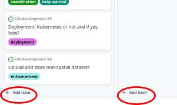
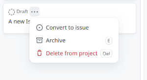

# :rocket: German GeoNode User Group (GeoNode-DE) :rocket:

This GitHub Group serves as **discussion platform** and **information-radiator** for the
German GeoNode User Group.

We use a [GitHub
project-board](https://docs.github.com/en/issues/planning-and-tracking-with-projects/learning-about-projects/about-projects) *User Group Activities*
as the main communication tool:

## :left_speech_bubble: Get in touch

- We have a classic mailing list: fdi-list@52north.org
  - You can subscribe to the list here: https://list.52north.org/mailman/listinfo/fdi-list
- Slack Channel exists here: https://geonode-deployment-de.slack.com (invitation is necessary)
- Via GitHub platform

## [User Group Activities](https://github.com/orgs/GeoNodeUserGroup-DE/projects/1/views/1)

### :loudspeaker: It can be used like a classical forum:

- The **columns** describe different topics: **`GN development`**, **`Meta`**.
  Anybody can add new columns to covering new topics at any time.

- The **cards** in these columns are GitHub
  [Issues](https://docs.github.com/en/issues), which we use to model sub-topics or threads.
  
- A click on a card will let you **see the discussion** and **write comments**.
  
- **Add a new Issue** from "Add item" at the bottom of the columns:

    

  Initially the new card will be a "Draft". Then you can convert it to an Issue
  (and assign to a repository) by clicking the top-right triple dots of the card.  

  
  
  Please provide a short description for new Issues in the appropriate field.

### :floppy_disk: The column-topics correspond to the repositories of this group

- This is just a convention to improve the clarity of the structure.
  If you disagree [open an Issue in Meta](https://github.com/GeoNodeUserGroup-DE/meta/issues/new) :grin:

- Some columns may appear empty for non members.
  We keep some repository private, so you may not see any issues as non-member. 

- The repositories can be used to make available documents, such as the
  presentation slides of meetings, concept papers, ...

### :dart: We have project-management features of GitHub also available for collaborative activities:

- [Assigning Issues](https://docs.github.com/en/issues/tracking-your-work-with-issues/assigning-issues-and-pull-requests-to-other-github-users)
  <!-- - [Task lists](https://docs.github.com/en/issues/tracking-your-work-with-issues/about-tasklists) -->
- [Notifications](https://docs.github.com/en/account-and-profile/managing-subscriptions-and-notifications-on-github/setting-up-notifications/configuring-notifications)
- [Labels](https://docs.github.com/en/issues/using-labels-and-milestones-to-track-work/managing-labels)
- [Milestones](https://docs.github.com/en/issues/using-labels-and-milestones-to-track-work/about-milestones)
  
