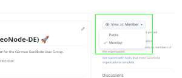

# :rocket: German GeoNode User Group (GeoNode-DE) :rocket:

This GitHub Group serves as **discussion platform** and **information-radiator** for the
German GeoNode User Group.

We use a [GitHub
project-board](https://docs.github.com/en/issues/planning-and-tracking-with-projects/learning-about-projects/about-projects) *User Group Activities*
as the main communication tool:

## :left_speech_bubble: Get in touch

- Via GitHub platform: 
  - Issues on the provided repositories
  - [Activity Board](https://github.com/orgs/GeoNodeUserGroup-DE/projects/1/views/1)
- We have a classic mailing list: fdi-list@52north.org
  - You can subscribe to the list here: https://list.52north.org/mailman/listinfo/fdi-list
- Slack Channel exists here: https://geonode-deployment-de.slack.com (invitation is necessary)

---

This is the member view of this welcome text.
You can switch between [public view](https://github.com/GeoNodeUserGroup-DE?view_as=public) and [member view](https://github.com/GeoNodeUserGroup-DE?view_as=member) on the right:

