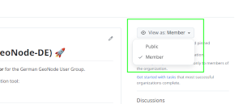

# :rocket: German GeoNode User Group (GeoNode-DE) :rocket:

This GitHub Group serves as **discussion platform** and **information-radiator** for the
German GeoNode User Group.

We use a [GitHub
project-board](https://docs.github.com/en/issues/planning-and-tracking-with-projects/learning-about-projects/about-projects) *User Group Activities*
as the main communication tool:

## :left_speech_bubble: Get in touch

- We have a classic mailing list: geonode-usergroup-de@listserv.dfn.de
  - You can subscribe to the list here: https://www.listserv.dfn.de/sympa/info/geonode-usergroup-de
- Via GitHub platform (for more technincal aspects): 
  - Issues on the provided repositories
  - [Activity Board](https://github.com/orgs/GeoNodeUserGroup-DE/projects/1/views/1)
- The (still existing) Slack Channel is deprecated for the time being, so do not expect too much activity on it
- we are also active on conferences (e.g. regularly on FOSSGIS and FOSS4G Europe)

This is the public view of this welcome text.
If you are a member you can switch between [public view](https://github.com/GeoNodeUserGroup-DE?view_as=public) and [member view](https://github.com/GeoNodeUserGroup-DE?view_as=member). See also the dropdown box on the right (for members):

